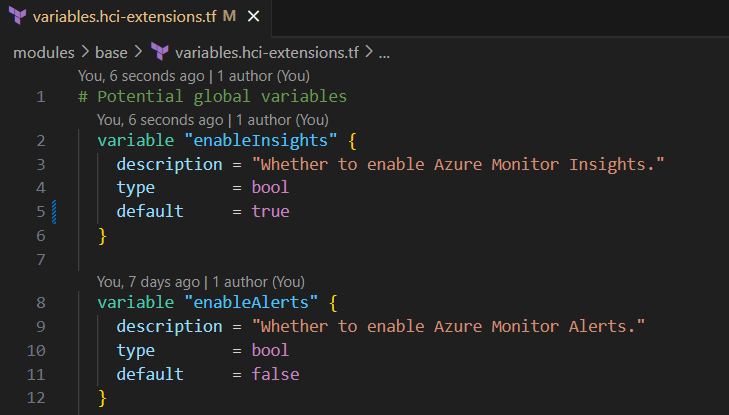

# Add HCI Insights

Go to `modules/base/variables.hci-extensions.tf`. Change default value of `enable_insights` from `false` to `true.`

Do the same to enable alerts by toggling the default value of `enable_alerts` for HCI.

## Next Step

[Go back to home page](../README.md)

Learn more:

- About [troubleshooting](./TroubleShooting.md)
