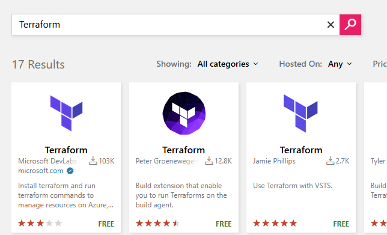

# Add Terraform Extension
> [!NOTE]
> This step adds the Terraform extension in your organization. If it's already installed, skip this step.

### Add Terraform extension to your organization

Click `Marketplace` on the top-right. Click `Browse marketplace`. Search for `Terraform`. Install the one developed by Microsoft DevLabs.

## Next steps

[Create IaC resources](./Create-IaC-Resources.md)
