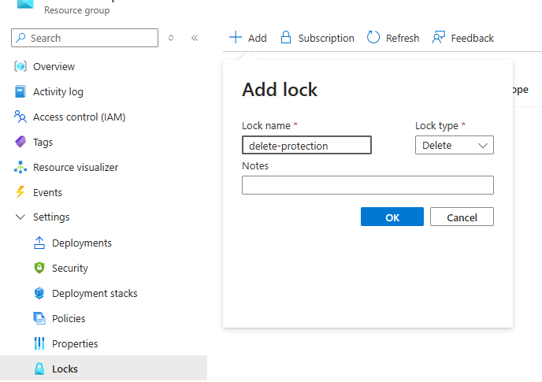

# Create an Azure Key Vault to Store Secrets

> [!NOTE]
> This step creates an Azure Key Vault to store secrets for IaC deployments and a storage account for Terraform backend. It is strongly recommended to create a new resource group to put the resources for IaC, including the key vault and the Terraform backend storage account.

## Key vault

Create a key vault [here](https://portal.azure.com/#create/Microsoft.KeyVault). This Key Vault will be used to store secrets for deployments.

<!-- TODO: add secret guidance -->

## Storage account

Create a storage account [here](https://portal.azure.com/#create/Microsoft.StorageAccount-ARM). Better **not** to use LRS account because this account is used to record current state of all resources for **all** sites.

Create a new blob container in the storage account.

### Setup Terraform backend

Open `.azure/backendTemplate.tf` in this repository. Replace `<ResourceGroupName>`, `<StorageAccountName>`, `<StorageContainerName>` to the storage account and container you just created.

Commit `.azure/backendTemplate.tf` by running `git commit` and the run `git push` to push the changes to the remote branch.

## Lock the resource group

Add a lock for the IaC resource group to prevent deletion.

## Next step

[Create service connection and grant roles](./Create-Service-Connection.md)
