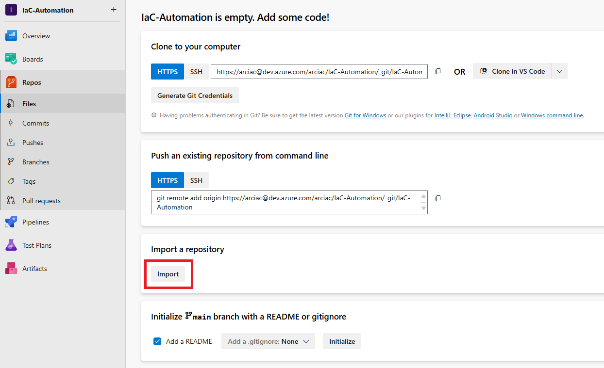

# Create a repository based on this template

> [!NOTE]
> This step creates a repository in your organization to contain infrastructure configuration codes and deployment pipeline definitions.

## Option 1: Create from AzDO UI

1. Click `Import` button.
2. Input `https://github.com/Azure/Edge-infrastructure-quickstart-template-ado` to `Clone URL`.
3. Clone the repo on your machine

## Option 2: Put contents to an existing repo

1. Clone your existing repo locally and go to the local repo path.
2. Run `git checkout -b init`
3. Run `git remote add azure https://github.com/Azure/Edge-infrastructure-quickstart-template-ado -t main`
4. Run `git fetch azure`
5. Run `git checkout azure/main .`
6. Run `git remote remove azure`
7. Run `git add .`
8. Run `git commit -m 'sync from https://github.com/Azure/Edge-infrastructure-quickstart-template-ado'`
9. Run `git push -u origin init`
10. Create pull request and merge `init` branch.

## Next step

[Setup AzDO agents](./Setup-Agents.md)
