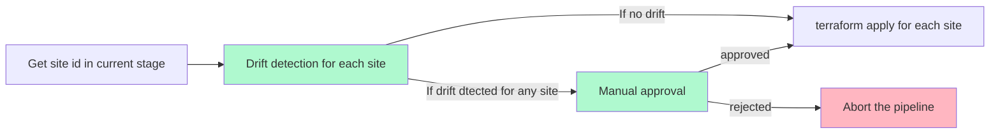
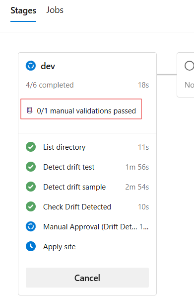
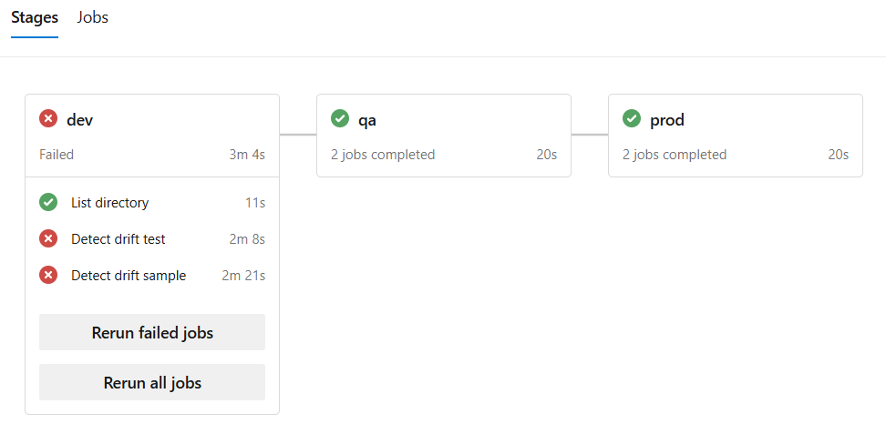
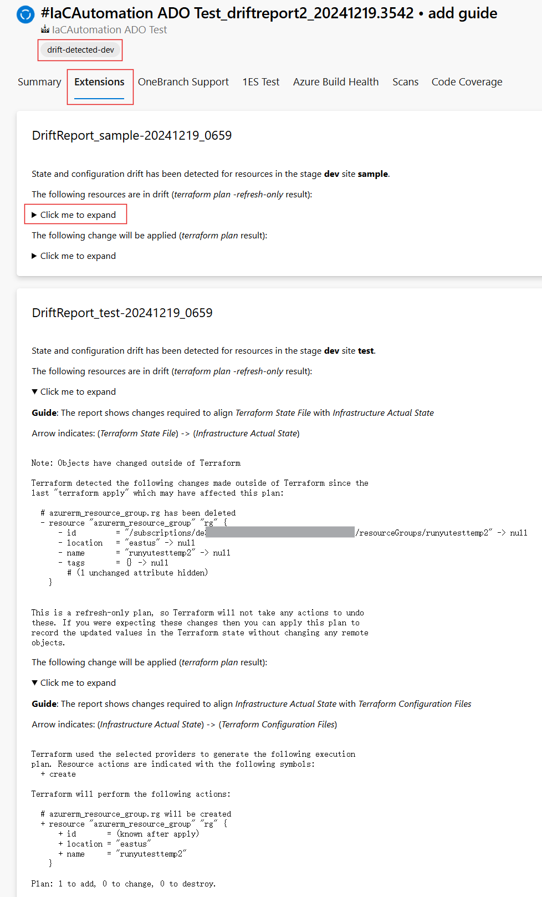

# Drift Detection
Terraform drift refers to the situation where the actual state of infrastructure in an environment diverges from the state defined in Terraform configuration files. If user makes changes to the infrastructure outside of terraform, it will cause drift in the infrastructure. It usually happens when user manually changes the configuration in Azure portal for testing or walkaround. There are two types of drift taken into consideration:

* **Configuration Drift**: the configuration file defined in your repo is drifted from the actual state of the infrastructure.
* **State Drift**: the [terraform state](https://developer.hashicorp.com/terraform/language/state) is drifted from the actual state of the infrastructure. 

To identify drift in the infrastructure, the following pipelines are integrated with drift detection:

* `.pipelines/deploy-infra.yml`: This pipeline applies the infrastructure from the config. Before running `terraform apply` to all sites in the stage, it checks for **state drift**. If drift is detected, user confirmation is required to proceed, and a summary is provided for review.
* `.pipelines/drift.yml`: This dedicated pipeline detects drift in the infrastructure. By default, it scans for **state drift**, but it could be configured to also detect **configuration drift**. If drift is detected, the corresponding job is marked as failed, and a drift summary is provided for review.

## Drift Detection in `.pipelines/deploy-infra.yml`
For each stage, the drift detection job is added before the `terraform apply` job.


You will need to configure `notifyUsers` if you want to receive email notification for the manual approval task.  See **FAQs** for more details. 

### FAQs

<details>
<summary> How to approve the drift detection? </summary>

A `ManualValidation` task will be added to the pipeline for user's approval if drift is detected for a stage. You could click on the `ManualValidation` task and click `Resume` to approve it. 



</details>

<details>
<summary> Is there timeout for the approval? </summary>

The `ManualValidation` task will be timeout in a day. If no action is taken, the pipeline will be aborted. If you want to proceed after the timeout, you could return to the pipeline and click `Rerun failed jobs` on the top right corner, and then you could approve the `ManualValidation` task again.

</details>

<details>
<summary> When should I approve the drift detection? When should I reject it? </summary>
You should approve the drift detection if you are aware of the changes made outside of terraform and you want to revert the changes to follow what is defined in the repo. The pipeline will run `terraform apply` after you approve the drift.

You should reject if the current infrastucture status is what you want to keep and you want to change the configuration in the repo to match the current status.

You could refer to [Manage terraform resource drift](https://developer.hashicorp.com/terraform/tutorials/state/resource-drift) for more guidance for handling resource drift.

</details>

</details>

<details>
<summary> Will I receive notifications for the manual approval task? </summary>

You need to set `notifyUsers` in `config-variables.yml`, please refer to [Config Variables](./Config-Variables.md) for more details.

</details>

<details>
<summary> What if I do not want to run drift detection before terraform apply? </summary>

You could set the parameter `disableDriftDetection` in `.pipeline/deploy-infra.yml` to `true` to disable it.

</details>

## Drift Detection in `.pipelines/drift.yml`

The `.pipeline/drift.yml` pipeline checks for drift. To create this pipeline, follow the instructions in [Create Deployment Pipeline](./Create-Pipeline.md) and select `.pipeline/drift.yml` when prompted for the pipeline YAML file.

You can trigger the pipeline manually or schedule it to run periodically by uncommenting the following lines in `.pipeline/drift.yml`:
```yaml
## Uncomment the following lines to run the pipeline on a schedule
# schedules:
# - cron: '0 8 * * *' # Everyday at 8:00 AM
#   branches:
#     include:
#     - main
``` 

The pipeline will scan all the stages  for drift and provide a summary for review. If drift is detected, the corresponding job will also be marked as failed for visibility. For example, the following figure means drift is detected in the `dev` stage for both  sites `test` and `sample`, and all other stages have no drift:



### FAQs
<details>
<summary> Can I configure the behavior for the type of drift to detect? </summary>

By default, drift detection in `.pipelines/drift.yml` shows both *state drift* and *configuration drift* in drift summary, but it reports drift only if *state drift* is found. You can configure this behavior with two parameters:
* `driftReportType`: Specifies the type of drift detection result to show in drift summary. Valid values are `State`, `Configuration`, or `All`. (default: `All`)
* `markDriftType`: Specifies when to mark a stage as drifted, effective only when `driftReportType` is `All`. Valid values are `State`, `Configuration`, or `All`. (default: `State`)

To report only *configuration drift*, set both `driftReportType` and `markDriftType` to `Configuration`. To report with any type of drift, set both `driftReportType` and `markDriftType` to `All`.

</details>

## Review Drift Summary
If drift is detected in either `.pipelines/deploy-infra.yml` or `.pipeline/drift.yml`, a summary will be available under the `Extensions` tab in your build. The build will also be tagged with `drift-detected-{stage}` if drift is detected for `{stage}`. An example of the drift summary is shown below:



## Next Step

[Go back to home page](../README.md)