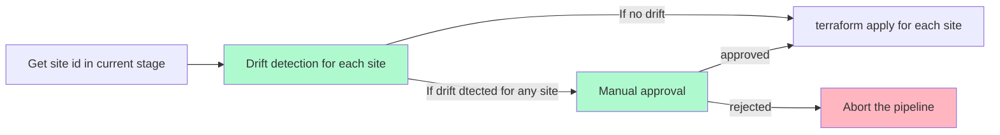
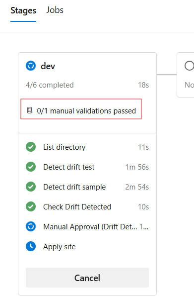
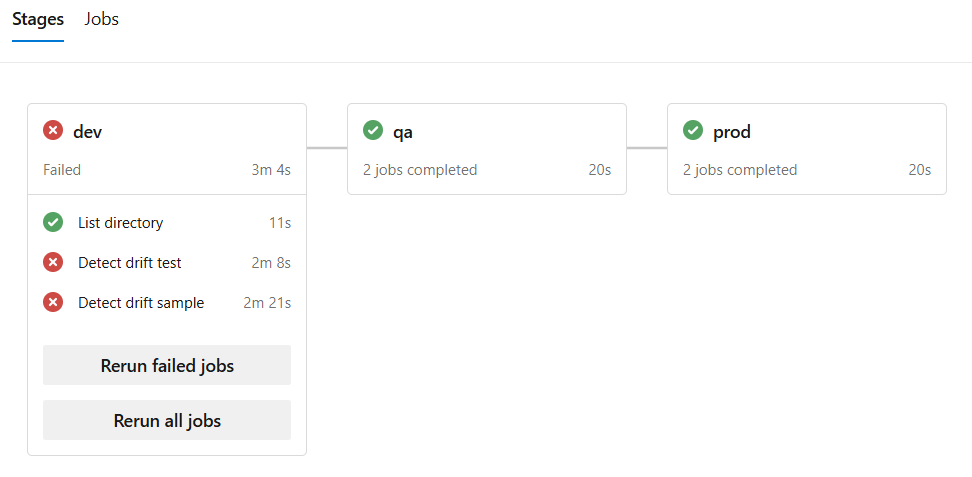
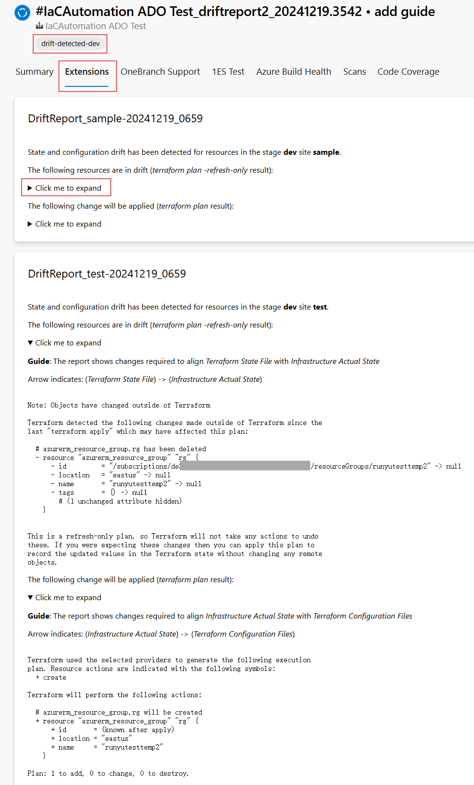

# Drift Detection
If user makes changes to the infrastructure outside of terraform, it will cause drift in the infrastructure. It usually happens when user manually changes the configuration in Azure portal for testing or walkaround. To help user identify drift in the infrasturcture, the following pipelines are integrated with drift detection:
* `.pipelines/deploy-infra.yml`: this is the pipeline you will run to apply the infrastructure from config. Before running `terraform apply` to all sites in the stage, it will first run drift detection. If any site is detected with drift, the pipeline will require for user's confirmation to proceed and provide a summary for review.
* `.pipeline/drift.yml`: this is a dedicated pipeline to detect drift in the infrastructure. It will scan your environment for any configuration drift or changes made outside of terraform. If any drift is detected, the corresponding job will be marked as failed and the drift summary will be provided for review.

## Drift Detection in `.pipelines/deploy-infra.yml`
For each stage, the drift detection job is added before the `terraform apply` job.

```mermaid
flowchart LR
    A[Get site id in current stage] --> B[Drift detection for each site] 
    B -->|If drift dtected for any site| C["Manual approval"] 
    C --> |approved| D[terraform apply for each site]
    C --> |rejected| E[Abort the pipeline]
    B --> |If no drift| D
    classDef added fill:#AFF9CF;
    classDef fail fill:#FFB6C1;
    class B,C added;
    class E fail;
```

You will need to configure `notifyUsers` if you want to receive email notification for the manual approval task.  See **FAQs** for more details. 

### FAQs

<details>
<summary> How to approve the drift detection? </summary>

A `ManualValidation` task will be added to the pipeline for user's approval if drift is detected for a stage. You could click on the `ManualValidation` task and click `Resume` to approve it. 



</details>

<details>
<summary> Is there timeout for the approval? </summary>

The `ManualValidation` task will be timeout in a day. If no action is taken, the pipeline will be aborted. If you want to proceed after the timeout, you could return to the pipeline and click `Rerun failed jobs` on the top right corner, and then you could approve the `ManualValidation` task again.

</details>

<details>
<summary> When should I approve the drift detection? When should I reject it? </summary>
You should approve the drift detection if you are aware of the changes made outside of terraform and you want to revert the changes to follow what is defined in the repo.

You should reject if the current infrastucture status is what you want to keep and you want to change the configuration in the repo to match the current status.

You could refer to [Manage terraform resource drift](https://developer.hashicorp.com/terraform/tutorials/state/resource-drift) for more guidance for handling resource drift.

</details>

</details>

<details>
<summary> Will I receive notifications for the manual approval task? </summary>

You need to set `notifyUsers` in `config-variables.yml`, please refer to [Config Variables](./Config-Variables.md) for more details.

</details>

<details>
<summary> What if I do not want to run drift detection before terraform apply? </summary>

You could set the parameter  `disableDriftDetection` in `.pipeline/deploy-infra.yml` to `false` to disable it.

</details>

## Drift Detection in `.pipeline/drift.yml`

The `.pipeline/drift.yml` pipeline checks for drift. To create this pipeline, follow the instructions in [Create Deployment Pipeline](./Create-Pipeline.md) and select `.pipeline/drift.yml` when prompted for the pipeline YAML file.

You can trigger the pipeline manually or schedule it to run periodically by uncommenting the following lines in `.pipeline/drift.yml`:
```yaml
## Uncomment the following lines to run the pipeline on a schedule
# schedules:
# - cron: '0 8 * * *' # Everyday at 8:00 AM
#   branches:
#     include:
#     - main
``` 

The pipeline will scan all the stages  for drift and provide a summary for review. If drift is detected, the corresponding job will also be marked as failed for visibility. For example, the following figure means drift is detected in the `dev` stage for both  sites `test` and `sample`, and all other stages have no drift:



## Review Drift Summary
If drift is detected, in either `.pipelines/deploy-infra.yml` or `.pipeline/drift.yml`, the following summary will be provided in your build for review. It is under the `Extensions` tab. Also the  `drift-detected-{stage}` tag will be marked as the tag of the build if drift is detected for `{stage}`. An exmpale of the drift summary is shown below:



## Next Step

[Go back to home page](../README.md)