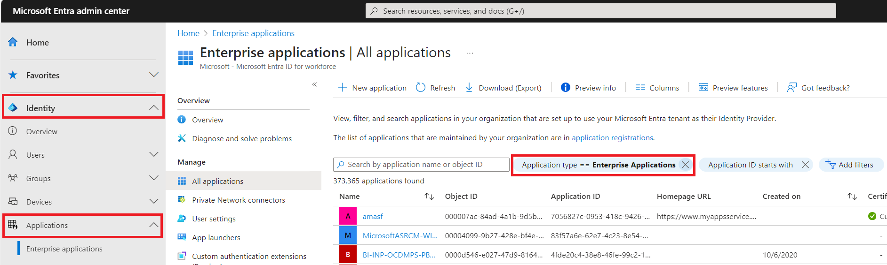
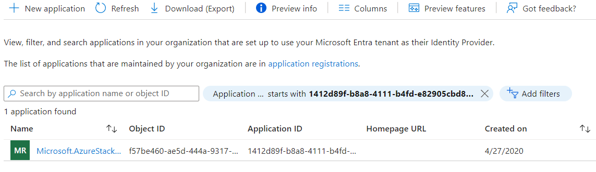
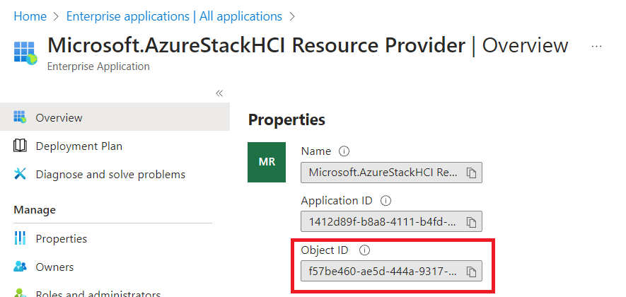
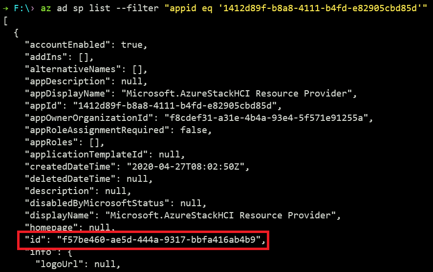

# Getting rpServicePrincipalObjectId

## Use UI
Go to [Microsoft Entra Admin Center](https://entra.microsoft.com/#home). Go to Identity -> Applications -> Enterprise applications. Remove the Application type filter.

Then, click the Application ID starts with filter. Input `1412d89f-b8a8-4111-b4fd-e82905cbd85d` and apply.

Click `Microsoft.AzureStackHCI Resource Provider`. Copy its Object ID, this value needs to be set to repository secret `rpServicePrincipalObjectId`.

## Use Az CLI

Run `az ad sp list --filter "appid eq '1412d89f-b8a8-4111-b4fd-e82905cbd85d'"`. Copy the value in `id` field.

