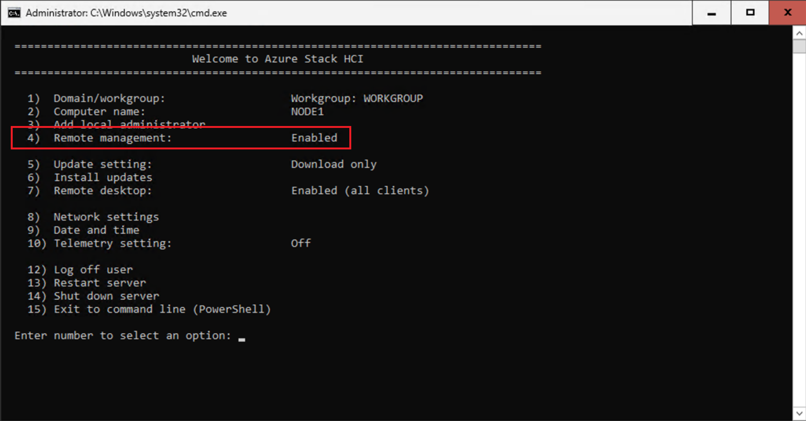
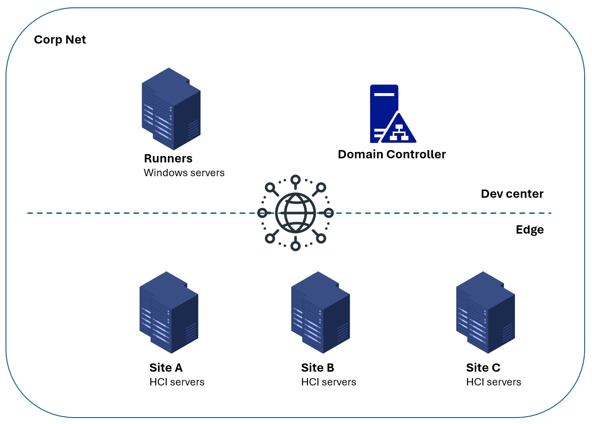

# Getting Started

## Prerequisites

Before you begin, make sure to complete the following prerequisite steps:

- Check deployment checklist and install AzureStack HCI OS on your servers to be deployed as AzureStack HCI clusters
- Complete Step 2 (Download the software) & 3 (Install the OS) in this [document](https://learn.microsoft.com/en-us/azure-stack/hci/deploy/download-azure-stack-hci-23h2-software).
- **Make sure `Remote management` section is `Enabled`.**

<mark>Step 1 (Prepare Active Directory) & 4 (Register with Arc and set up permissions) are covered in the project.</mark>

## Overview

The QuickStart solution uses remote PowerShell to complete the Active Directory preparation and Arc registration. The following picture shows an overview of a basic hardware setup.

In the development center, Windows servers function as Azure DevOps (AzDO) agents and Active Directory Domain Controllers. On the edge, servers are equipped with HCI OS. All servers are connected to the corporate network. Edge servers enable remote management within the corporate network, with no inbound connections allowed from the Internet.
This hardware setup allows system admins to provision HCI clusters at scale by AzDO pipelines.

## Setup

1. [Create a repository based on this template](./Create-Repository.md)
2. [Setup AzDO agents](./Setup-Agents.md)
3. [Add Terraform AzDO extension](./Add-Terraform-Extension.md)
4. [Create IaC resources](./Create-IaC-Resources.md)
5. [Create service connection and grant roles](./Create-Service-Connection.md)
6. [Create pipeline](./Create-Pipeline.md)

## Next Step

[Go back to home page](../README.md)

Learn more:

- About [adding your first site with static templates](./Add-The-First-Site.md)
- About [your CI/CD pipeline running status](./View-pipeline.md)
- About [troubleshooting](./TroubleShooting.md)
- About [enabling arc extensions for all sites](../README.md#enable-opt-in-features-for-all-sites)
