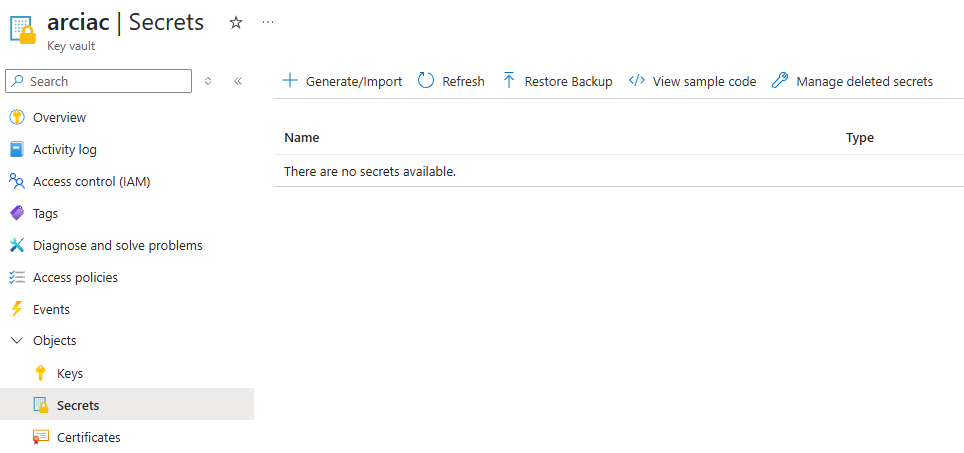
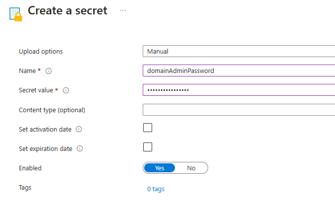
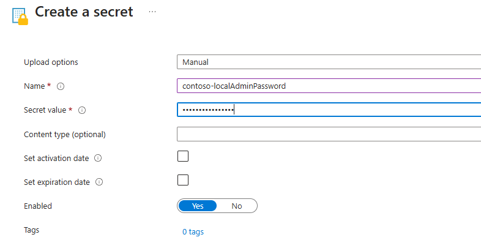

# Secrets Structure

Unlike configuration codes stored in the Git repo, secrets cannot be put in the codebase. The repo structure for infrastructure codes is hierarchical, so is secrets structure. Secrets are stored in the Key Vault created in the [Getting Started / Create IaC Resources ](./Create-IaC-Resources.md#create-an-azure-key-vault-to-store-secrets).

## Globally shared secrets

Some secrets are shared for all site. For example, the domain admin user and password for AD preparation steps. These secrets can be defined by setting the value to a secret in the Key Vault.



For instance, we can create `domainAdminPassword` secret and set the password to the value field.



## Site secrets

Some secrets are different across sites. For example, the local admin user and password for HCI servers. There secrets can be defined by a secret with `<site_id>-<secret_name>` pattern.

For instance, we can create `contoso-localAdminPassword` secret and set the local admin password for `contoso` site.



## How is secrets mapped to Terraform variables

Definitions of secret variables can be found in `dev/sample/variables.tf`. Secret mappings from the Key Vault secret name to Terraform variable name needs to be defined in `.pipelines/secrets.json`. A sample mapping is defined in this repo.
```json
{
    "localAdminUser": "local_admin_user",
    "localAdminPassword": "local_admin_password",
    "domainAdminUser": "domain_admin_user",
    "domainAdminPassword": "domain_admin_password",
    "deploymentUserPassword": "deployment_user_password",
    "arbServicePrincipalId": "service_principal_id",
    "arbServicePrincipalSecret": "service_principal_secret",
    "rpServicePrincipalObjectId": "rp_service_principal_object_id",
    "vmAdminPassword": "vm_admin_password",
    "domainJoinPassword": "domain_join_password"
}
```

## How to leverage the shared Key Vault for HCI deployment

The following secrets are used in HCI deployment. Do not use the same secret name to avoid conflicts.

- AzureStackLCMUserCredential
- LocalAdminCredential
- DefaultARBApplication
- WitnessStorageKey

These HCI secrets will be created in IaC pipeline from the secrets you set in the Key Vault in the format of `<hci_cluster_name>-<secret_name>`.
