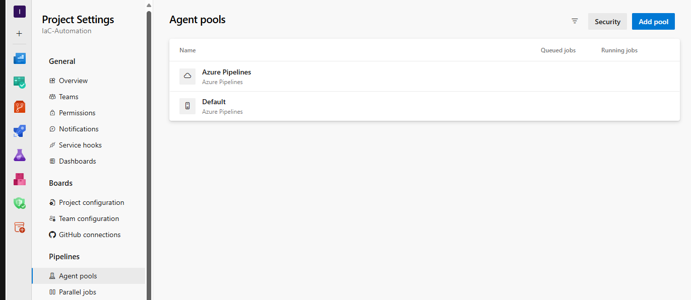
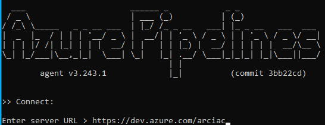
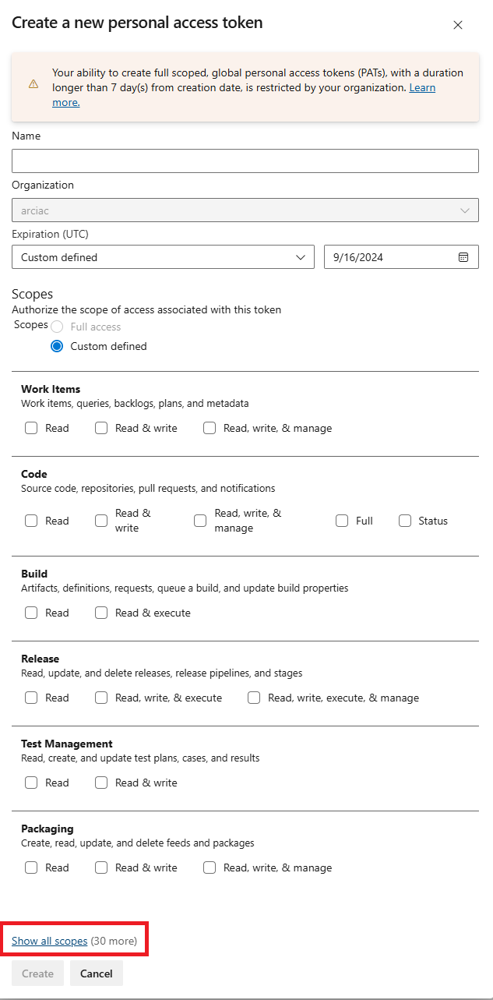
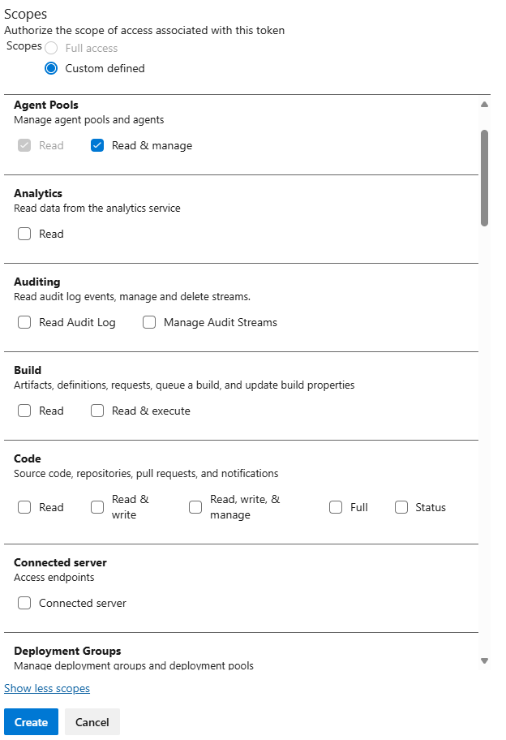
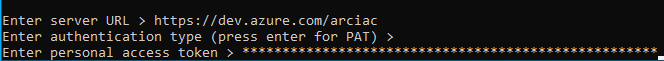
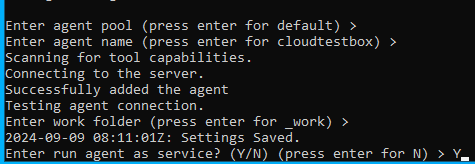
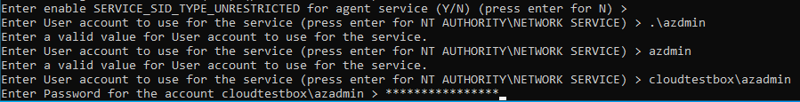

# Setup Agents

> [!NOTE]
> This step creates an agent to run deployment actions. The agent needs to be a Windows machine with Git and Az CLI installed. Git bash needs to be added to the PATH.

## (Optional) Create a new agent pool
Click `Project settings` -> `Agent pools` -> `Add pool`. Select `Self-hosted` type and input the name of the pool.



## Setup the agent

The agent needs to be a Windows machine in your Corp network that can remote access all the machines on edge. Connect to the machine. Download a setup script from [ado-self-hosted-runner.ps1](https://aka.ms/ado-self-hosted-runner) and run it on the machine.

The script will
 - Check Git is installed. If not, Git will be downloaded and installed.
 - Check Az CLI is installed. If not, Az CLI will be downloaded and installed.
 - Add remote PowerShell client settings for CredSSP auth.
 - Download AzDO agent binary and configure.

## Step-by-step inputs

A detailed instruction can be found [here](https://learn.microsoft.com/en-us/azure/devops/pipelines/agents/windows-agent?view=azure-devops). A step-by-step screenshots is provided in this page as of Sep. 2024.

### Server URL


### PAT

**1.** Click `Personal access tokens`.


**2.** Click `Show all scopes`.



**3.** Select `Agent Pools -> Read & manage` and `Deployment Groups -> Read & manage`.



**4.** Click `Create`. Copy the value of PAT. Paste to the line `Enter personal access token`.


### Agent pool

Press enter to use the default agent pool. If you created agent pool in the previous step or you want to use non-default pool, input the name.

### Agent name

Press enter to use the computer name.

### Work folder

Press enter to use the default value.

### Run as service

Input `Y` to run as service.



Use an admin account to run the service. Use `<machine_name>\<admin_name>` to use a local admin account. Use `<domain>\<domain_account>` or `<user_id>@<corp_domain>` to use a domain account.



Press enter to restart the agent service.

## Let the deployment pipeline use your agent

Open `.pipelines/deploy-infra.yml`. Change line 5.

```yml
pool: <your_pool_name> # TODO: Change this to your pool name
```

Example

```yml
pool: Default
```

## Next steps

[Add Terraform AzDO extension](./Add-Terraform-Extension.md)
